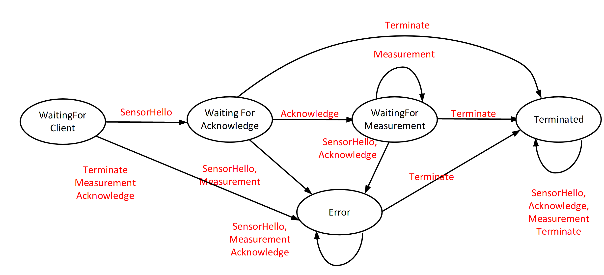
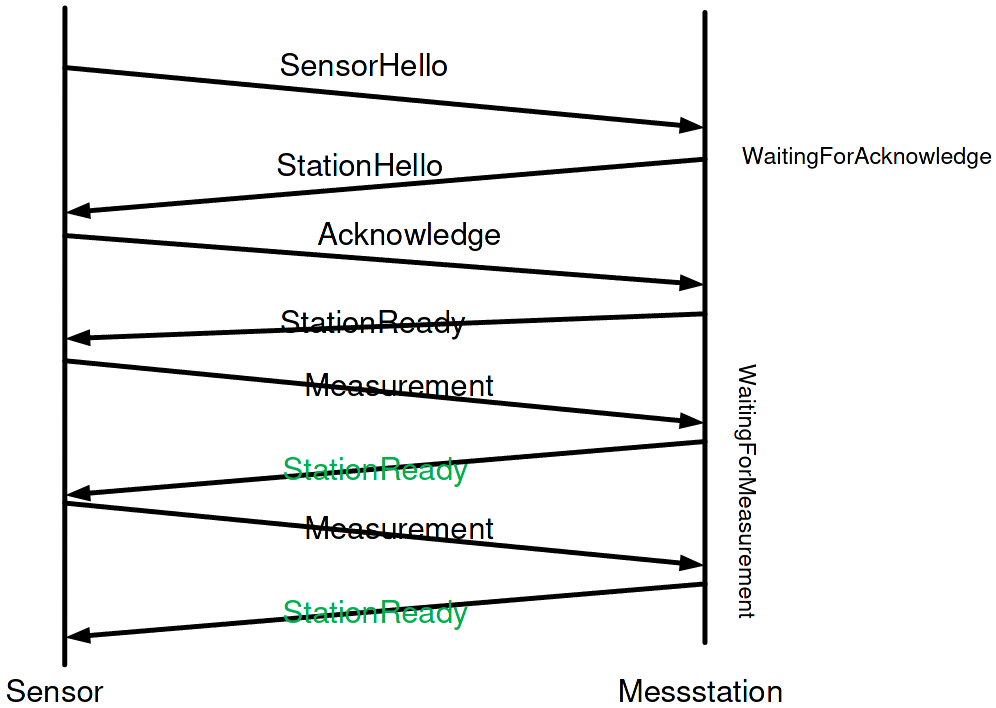

# Table of Contents

1. [General Info](#general-info)
2. [Technologies](#technologies)
3. [Installation](#installation)

# General-info

This is a simple server application witch can receive a Json String with a measurement Object. 
After receiving the String it will get converted into a measurement object witch is then added to a List of measurement objects. 
When the programm stopps it will save all saved measurement objects into a file.

## How To talk to the Server:

| Send                                                                   | Receive                                      |
|:---------------------------------------------------------------------- | ------------------------------------------- |
| `{"type":"sensor_hello","payload":{}}`                                 | `{"type":"statopn_hello","payload":{}}`     |
| `{"type":"acknowledge","payload":{}}`                                  | `{"type":"station_ready","payload":{}}`     |
| `{"type":"measurement","payload":{`[Measurement](#Mearuement json)`}}` | `{"type":"station_ready","payload":{}}`     |
| You can send more Measurement jsons                                    |                                             |
| `{"type":"terminate","payload":{}}`                                    | `{"type":"terminate_station","payload":{}}` |

## Measurement json

A measurement has to contain:

- A Value witch is a int

- A [type](#type)

- A [unit](#unit)

- A Timestamp

In the end it should look like this

```json
{"value" : 10,"unit" : "none","type" : "none","timestamp" : [ 2021, 5, 2, 15, 8, 29, 191725000 ]}
```

### Type

The different Types you can use:

- TEMPERATURE  

- HUMIDITY

- PRESSURE

- COUNT

- FLOW_RATE

- ENERGY

### Unit

The different Units you can use:

- CELSIUS

- KELVIN

- PERCENT

- FAHRENHEIT

- HECTOPASCAL

- UNITS

- CMS2

- KWH3

## Diagrams

The connection automat (Warning: Symbols are a bit different!)

A simple connection between the server and the station (Warning: Messages look different!)


# Technologies

 A list of technologies used within the project:

* [Log4j2](https://logging.apache.org/log4j/2.x/) Version: 2.14.1

* [Jackson](https://github.com/FasterXML/jackson) Version: 2.12.3

* [Jacoco](https://www.jacoco.org/jacoco/trunk/index.html) Version: 0.8.6

* [SonarQube](https://www.sonarqube.org/) Version: 8.8

# Installation

How to install:

Enter the following commands<br/>
```shell
docker pull inf-docker.fh-rosenheim.de/vv-inf-sose21/asbeckalexander:latest
run -p 1024:1024 asbeckalexander:latest
```
You might need root permissions on your system to run docker<br/>
On Linux run the commands with sudo in at the start.<br/>
In Windows just open the shell with administrator rights and run the commands<br/>
[How to install docker](https://www.docker.com/get-started)
